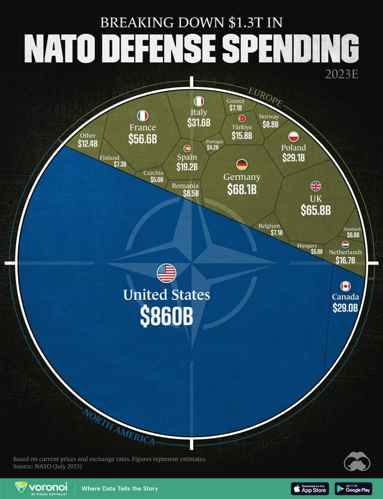

# Programming Skills Map - Interactive Skill Tree Visualization

A roadmap.sh-style skill visualization using weighted Voronoi Treemap algorithm to display programming competencies grouped by technical domains.



## 🌟 Features

- **Weighted Area Distribution**: Cell area accurately represents skill importance/proficiency
- **Hierarchical Grouping**: Skills grouped by domain (Frontend, Backend, DevOps, Mobile)
- **Interactive Drill-Down**: Click any skill to zoom into its domain view
- **roadmap.sh-Style Layout**: Clean domain clusters with thick borders
- **Responsive Design**: Circular layout with adaptive labels

## 🎯 Why This Approach?

### Problem with Standard Voronoi
Standard Voronoi diagrams (like `d3.Delaunay`) only distribute space based on seed point distance, completely ignoring weights. This results in:
- Low-importance skills appearing disproportionately large
- No natural grouping of related technologies
- Fragmented, random-looking distributions

### Solution: Weighted Voronoi Treemap
Uses the `d3-voronoi-treemap` library which:
- Iteratively adjusts cell boundaries to match area with weight
- Respects hierarchical parent-child relationships (domain → skills)
- Creates natural domain clusters (roadmap.sh-style effect)
- Achieves 0.1% accuracy through convergence algorithm

## 🏗️ Technical Implementation

### Four-Domain Grouping Strategy

**Why domain grouping?**
- Creates clear skill clusters by technical area
- Similar to roadmap.sh's domain organization
- Better visual separation and clarity

**Selected Domains:**
- **Frontend** 🎨 - UI/UX technologies (React, Vue, TypeScript, CSS, etc.)
- **Backend** ⚙️ - Server-side tech (Node.js, Python, databases, APIs, etc.)
- **DevOps** 🚀 - Infrastructure & deployment (Docker, K8s, AWS, CI/CD, etc.)
- **Mobile** 📱 - Mobile development (React Native, Flutter, Swift, Kotlin, etc.)

### roadmap.sh-Style Effect (3 Steps)

1. **Domain Voronoi**: Calculate 4 large domain polygons using weighted treemap
   - Each domain gets area proportional to its total skill importance
   - Creates distinct regional boundaries (like roadmap.sh's skill groupings)

2. **Nested Skill Distribution**: Within each domain polygon, distribute skills
   - Skills only appear within their parent domain's boundary
   - Maintains visual grouping (e.g., all Frontend skills cluster together)
   - Similar to how roadmap.sh groups related technologies

3. **Domain Borders**: Draw thick borders (#333, 3px) around domain polygons
   - Creates clear visual separation between technical domains
   - Labels placed outside circle using polygon centroids

### Core Algorithm

```javascript
// 1. Create hierarchical skill data structure
const skillData = {
    name: "Tech Skills",
    children: [
        { name: "Frontend", children: [/* React, Vue, etc. */] },
        { name: "Backend", children: [/* Node.js, Python, etc. */] },
        { name: "DevOps", children: [/* Docker, K8s, etc. */] },
        { name: "Mobile", children: [/* React Native, Flutter, etc. */] }
    ]
};

// 2. Apply weighted Voronoi treemap
const voronoiTreemap = d3.voronoiTreemap()
    .clip(circlePolygon)              // Clip to circular boundary
    .convergenceRatio(0.001)          // 0.1% accuracy threshold
    .maxIterationCount(100)           // Max optimization iterations
    .minWeightRatio(0.001);           // Min cell size threshold

voronoiTreemap(root);                 // Calculates BOTH levels simultaneously

// Result: Each skill.polygon is automatically CLIPPED to its parent domain!
```

## 📊 Data Structure

```javascript
{
    name: "Tech Skills",
    children: [
        {
            name: "Frontend",
            children: [
                { name: "React", value: 180 },       // value = importance/proficiency
                { name: "Vue.js", value: 150 },
                { name: "TypeScript", value: 160 },
                // ... more skills
            ]
        },
        {
            name: "Backend",
            children: [
                { name: "Node.js", value: 170 },
                { name: "Python", value: 160 },
                { name: "PostgreSQL", value: 130 },
                // ... more skills
            ]
        },
        // ... DevOps and Mobile domains
    ]
}
```

**Value Guidelines:**
- Represents skill importance, demand, or your proficiency level
- Range: 50-200 points
- Can be based on: GitHub stars, job postings, usage frequency, or personal assessment

## 📦 Dependencies

```html
<script src="https://cdn.jsdelivr.net/npm/d3@7"></script>
<script src="https://cdn.jsdelivr.net/npm/d3-weighted-voronoi@1"></script>
<script src="https://cdn.jsdelivr.net/npm/d3-voronoi-map@2"></script>
<script src="https://cdn.jsdelivr.net/npm/d3-voronoi-treemap@1"></script>
```

**⚠️ Critical:** Missing `d3-weighted-voronoi` will cause error: `"i.weightedVoronoi is not a function"`

## 🚀 Quick Start

1. Clone or download this repository
2. Open `index.html` in a modern browser
3. Wait 2-3 seconds for initial calculation
4. Hover over skills to see proficiency details
5. Click any skill to drill down into domain view
6. Click empty space to return to overview

## 🎨 Visualization Details

- **Color Scheme**: Each domain has a distinct color family
  - Frontend: Blue 🎨 (UI/visual-focused)
  - Backend: Green ⚙️ (server-side)
  - DevOps: Orange 🚀 (infrastructure)
  - Mobile: Purple 📱 (mobile platforms)
- **Borders**: White strokes (1.5px) between skills, thick black (3px) between domains
- **Labels**: Dynamic font size based on cell area (8-18px)
- **Opacity**: 0.9 default, 1.0 on hover

## 🐛 Bug Fixes Applied

### Bug #1: Area Proportionality Failure
- **Symptom**: High-value items appearing smaller than low-value items
- **Cause**: Used `d3.Delaunay` which ignores weights
- **Evidence**: Expected vs actual area mismatch (35.7% → 8.6%)
- **Fix**: Replaced with `d3.voronoiTreemap()`
- **Result**: Areas now correctly match weight proportions

### Bug #2: Domain Labels at Origin
- **Symptom**: All 4 domain labels stuck in top-left corner
- **Cause**: `voronoiTreemap()` doesn't preserve `x/y` coordinates from pack layout
- **Evidence**: Log showed `{"x":undefined,"y":undefined,"angle":null,"labelX":null}`
- **Fix**: Changed to use `d3.polygonCentroid(domain.polygon)` for angle calculation
- **Result**: Labels correctly distributed around circle perimeter

## ⚡ Performance

- **Initial Render**: ~2-3 seconds for 33 skills across 4 domains
- **Convergence**: Up to 100 iterations to achieve 0.1% accuracy
- **Polygon Clipping**: 64-point circle for smooth boundaries

## 🔧 Customization

### Update Your Skills
Edit the `skillData` object (around line 413):
```javascript
const skillData = {
    name: "Tech Skills",
    children: [
        {
            name: "Frontend",
            children: [
                { name: "YourSkill", value: 150 },  // Add your skills here
                // ...
            ]
        }
    ]
};
```

### Adjust Proficiency Values
- **50-80**: Beginner level
- **80-120**: Intermediate level
- **120-160**: Advanced level
- **160-200**: Expert level

### Change Color Schemes
```javascript
const continentColorSchemes = {
    'Frontend': d3.interpolateBlues,
    'Backend': d3.interpolateGreens,
    'DevOps': d3.interpolateOranges,
    'Mobile': d3.interpolatePurples
};
```

### Modify Convergence Accuracy
```javascript
.convergenceRatio(0.001)  // 0.1% accuracy (lower = more accurate, slower)
```

## 💡 Use Cases

- **Personal Portfolio**: Visualize your skill distribution
- **Team Competency Mapping**: Show team's collective skills
- **Learning Roadmap**: Plan your learning path
- **Technology Stack**: Display project tech stack
- **Skill Gap Analysis**: Identify areas for growth

## 📖 References

- [roadmap.sh](https://roadmap.sh) - Inspiration for skill grouping
- [d3-voronoi-treemap Documentation](https://github.com/Kcnarf/d3-voronoi-treemap)
- [Weighted Voronoi Stippling](http://www.cs.ubc.ca/labs/imager/tr/2002/secord2002b/)

## 📄 License

MIT License - Feel free to use and modify

## 🤝 Contributing

Suggestions and improvements are welcome! Please open an issue or submit a pull request.

---

**Note**: The skill values in this demo are examples. Customize them to reflect your own proficiency levels or use objective metrics like GitHub stars, npm downloads, or job market demand.
